# Análisis del Notebook: art.ipynb

## Resumen General

Este notebook implementa un **ataque adversarial usando el método Carlini-Wagner L2** contra un modelo de clasificación de imágenes basado en Vision Transformer (ViT). El objetivo es generar ejemplos adversariales que engañen al modelo para clasificar imágenes falsas (fake) como reales (real).

---

## Estructura del Notebook

### 1. **Importaciones y Configuración Inicial**

```python
from art.attacks.evasion import CarliniL2Method, HopSkipJump
from art.estimators.classification import PyTorchClassifier, BlackBoxClassifier
import torch
import timm
from torchvision import transforms
from PIL import Image
```

**Propósito:**
- Importa la biblioteca **ART (Adversarial Robustness Toolbox)** para ataques adversariales
- Usa **PyTorch** y **timm** para el modelo de Vision Transformer
- Importa herramientas de transformación de imágenes

**❌ ERROR IDENTIFICADO:**
```
ModuleNotFoundError: No module named 'art'
```

---

### 2. **Configuración del Dispositivo**

```python
device = torch.device('cuda' if torch.cuda.is_available() else 'cpu')
print(device)  # Output: cuda
```

**Propósito:**
- Verifica disponibilidad de GPU
- El notebook se ejecutó en CUDA (GPU disponible)

---

### 3. **Carga del Modelo Vision Transformer**

```python
target_model = timm.create_model('vit_base_patch16_224.augreg_in21k_ft_in1k', pretrained=True)
target_model.head = torch.nn.Linear(target_model.head.in_features, 2)
target_model = target_model.to(device)
target_model.load_state_dict(torch.load("../weights/vit_teacher.pth"))
target_model.eval()
```

**Propósito:**
- Carga un Vision Transformer pre-entrenado (ViT-Base, patch 16x16, 224x224)
- **Modifica la cabeza del modelo** para clasificación binaria (2 clases: fake/real)
- Carga pesos personalizados desde `../weights/vit_teacher.pth`
- Coloca el modelo en modo evaluación

**Arquitectura del modelo:**
- VisionTransformer con 12 bloques de atención
- Embedding dimension: 768
- MLP dimension: 3072
- 2 clases de salida (fake/real)

**⚠️ Advertencia:**
- Se usó `torch.load` con `weights_only=False`, lo cual puede ser inseguro

---

### 4. **Configuración del Clasificador ART**

```python
labels = {}
labels[0] = "fake"
labels[1] = "real"

classifier = PyTorchClassifier(
    model = target_model,
    loss = torch.nn.CrossEntropyLoss(),
    nb_classes = len(labels),  # 2 clases
    input_shape = (3, 224, 224)
)
```

**Propósito:**
- Envuelve el modelo PyTorch en un clasificador compatible con ART
- Define las etiquetas: 0=fake, 1=real
- Especifica la forma de entrada (3 canales RGB, 224x224 píxeles)

---

### 5. **Creación del Ataque Carlini-Wagner L2**

```python
attack = CarliniL2Method(classifier)
```

**Propósito:**
- Inicializa el ataque **Carlini-Wagner L2 (C&W)**
- Este ataque es uno de los más efectivos para generar ejemplos adversariales
- Busca perturbaciones mínimas que engañen al modelo

**¿Qué es el ataque C&W L2?**
- Minimiza la distancia L2 entre la imagen original y la adversarial
- Optimiza para encontrar la perturbación más pequeña que cambie la clasificación
- Es un ataque de caja blanca (white-box) que requiere acceso al gradiente

---

### 6. **Generación del Ejemplo Adversarial**

```python
img = Image.open("../static/fake/0001_00_00_01_0.jpg")

# Preprocesamiento estándar de ImageNet
preprocess = transforms.Compose([
    transforms.Resize(256), 
    transforms.CenterCrop(224),
    transforms.ToTensor(),
    transforms.Normalize(
        mean=[0.485, 0.456, 0.406],
        std=[0.229, 0.224, 0.225]
    )
])

# Para revertir la normalización
unnormalize = transforms.Normalize(
   mean= [-m/s for m, s in zip([0.485, 0.456, 0.406], [0.229, 0.224, 0.225])],
   std= [1/s for s in [0.229, 0.224, 0.225]]
)

img_tensor = preprocess(img).unsqueeze(0)
adversarial_example = attack.generate(img_tensor.numpy())
```

**Propósito:**
- Carga una imagen **fake** del dataset
- Aplica el preprocesamiento estándar de ImageNet
- Genera el ejemplo adversarial usando el ataque C&W
- La imagen original es de clase "fake" (0)

**Pipeline:**
1. Redimensionar a 256x256
2. Recorte central a 224x224
3. Convertir a tensor
4. Normalizar con medias/desviaciones de ImageNet

---

### 7. **Verificación del Ataque**

```python
adv_tensor = torch.from_numpy(adversarial_example).to(device)
output = target_model(adv_tensor)

print(f"Output index:\n---------------\n{output[0].argmax()}\n")
print(f"Output label:\n---------------\n{labels[output[0].argmax().item()]}\n")
```

**Salida:**
```
Output index:
---------------
1

Output label:
---------------
real
```

**✅ Resultado del Ataque:**
- El modelo clasificó el ejemplo adversarial como **"real" (clase 1)**
- **El ataque fue exitoso**: la imagen fake fue clasificada como real
- Esto demuestra la vulnerabilidad del modelo a ataques adversariales

---

### 8. **Guardar la Imagen Adversarial**

```python
def tensor_to_pil(img_tensor):    
    unnormed_tensor = unnormalize(img_tensor)
    return transforms.functional.to_pil_image(unnormed_tensor[0])

masked_pil = tensor_to_pil(adv_tensor)
masked_pil.save(fp="../static/adversarial/output_art.png")
```

**Propósito:**
- Convierte el tensor adversarial de vuelta a imagen PIL
- Desnormaliza la imagen
- Guarda la imagen adversarial en `../static/adversarial/output_art.png`

---

## 🔴 Análisis del Error

### Error Principal

```
ModuleNotFoundError: No module named 'art'
```

**Causa:**
- La biblioteca `adversarial-robustness-toolbox` (ART) no está instalada en el entorno

### Solución

Instalar la biblioteca ART:

```bash
pip install adversarial-robustness-toolbox
```

O si usas conda:

```bash
conda install -c conda-forge adversarial-robustness-toolbox
```

### Dependencias Adicionales

Asegúrate de tener todas las dependencias instaladas:

```bash
pip install torch torchvision timm pillow numpy
pip install adversarial-robustness-toolbox
```

---

## ⚠️ Advertencia de Seguridad

El notebook tiene esta advertencia:

```
FutureWarning: You are using `torch.load` with `weights_only=False`
```

**Recomendación:**
- Cambiar a `torch.load(..., weights_only=True)` si es posible
- O usar `torch.serialization.add_safe_globals` para permitir objetos específicos

**Código corregido:**
```python
target_model.load_state_dict(
    torch.load(
        "../weights/vit_teacher.pth",
        weights_only=True  # Más seguro
    )
)
```

---

## 📊 Flujo Completo del Ataque

```mermaid
graph TD
    A[Imagen Original: fake] --> B[Preprocesamiento ImageNet]
    B --> C[Normalización]
    C --> D[Ataque Carlini-Wagner L2]
    D --> E[Generación de Perturbación]
    E --> F[Ejemplo Adversarial]
    F --> G[Inferencia en Modelo ViT]
    G --> H[Predicción: real]
    F --> I[Guardar Imagen]
    I --> J[../static/adversarial/output_art.png]
```



---

## 🎯 Conclusiones

1. **Funcionalidad:** El notebook implementa un ataque adversarial efectivo contra un clasificador ViT de imágenes fake/real

2. **Éxito del Ataque:** El ataque C&W logró engañar al modelo para clasificar una imagen fake como real

3. **Error Crítico:** Falta instalar `adversarial-robustness-toolbox`

4. **Riesgo de Seguridad:** Uso de `torch.load` con `weights_only=False`

5. **Implicaciones:** Demuestra la vulnerabilidad de los modelos de deep learning a ataques adversariales, incluso en arquitecturas avanzadas como Vision Transformers

---

## 🔧 Próximos Pasos

1. Instalar ART: `pip install adversarial-robustness-toolbox`
2. Actualizar el código de carga de pesos para mayor seguridad
3. Ejecutar el notebook completo
4. Comparar visualmente la imagen original vs. la adversarial
5. Evaluar otras métricas de ataque (distancia L2, tasa de éxito, etc.)
